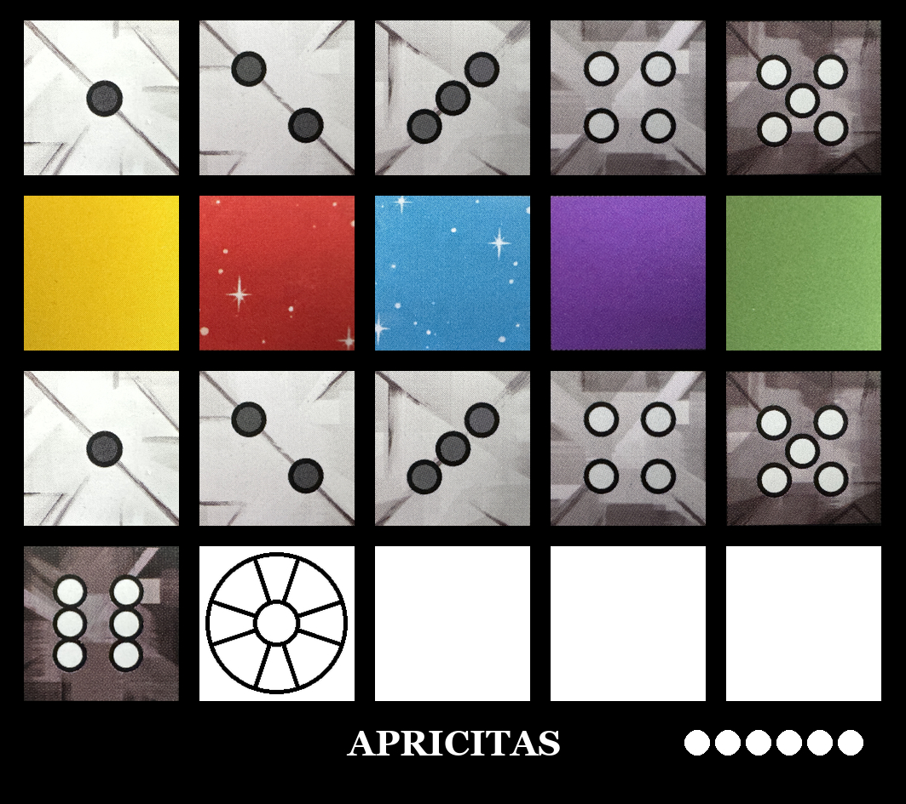

# Sagrada Card Generator

A Python-based card generator for creating print-and-play (PnP) cards for the Sagrada board game. This tool generates professional-quality PNG images with precise layouts, bleed margins, and 300 DPI resolution suitable for commercial printing.

## Features

- 🎨 **Professional Print Quality**: 300 DPI output with 5mm bleed margins
- 🎲 **Complete Tile System**: Support for numbered dice (1-6) and colored constraint tiles
- 📐 **Precise Layout**: 4×5 grid positioning with proper spacing
- 🎯 **Difficulty Indicators**: Visual ball system for card difficulty rating
- 🖋️ **Custom Typography**: Any font can be used
- 📦 **Batch Processing**: Generate multiple cards from a single input file

## Project Origin

This project evolved from a [BoardGameGeek PowerShell script](https://boardgamegeek.com/filepage/219948/sagrada-card-generator), was [migrated to Python](https://gitlab.com/jirsis/sagrada-generator), and enhanced with additional features. It includes the complete collection of Sagrada promos and packs as listed in this [BGG reference](https://boardgamegeek.com/thread/2737742/list-all-sagrada-promos-and-packs).

## Requirements

- Python 3.6+
- PIL/Pillow library

## Testing

To run the unit and integration tests:

1.  **Install test dependencies**:
    ```bash
    pip install -r requirements.txt
    ```

2.  **Run tests using pytest**:
    ```bash
    pytest
    ```

3.  **Run specific test file**:
    ```bash
    pytest test_sagrada_generator.py
    ```

## Installation & Setup

1. **Clone the repository**:
   ```bash
   git clone <repository-url>
   cd sagrada_generator
   ```

2. **Install virtual environment (optional but recommended)**:
   ```bash
   python -m venv venv
   source venv/bin/activate  # On Windows: venv\Scripts\activate
   ```

3. **Install dependencies**:
   ```bash
   pip install -r requirements.txt
   ```

4. **Verify required assets** are present:
   ```
   assets/
   ├── georgia.ttf    # Font file
   ├── 1.png, 2.png ... 6.png      # Dice tiles
   └── R.png, G.png, B.png, P.png, Y.png, W.png  # Color tiles
   ```

## Usage

### Basic Usage

Generate all cards defined in `card.txt`:

```bash
python sagrada_generator.py
```

This creates a `sagrada_output/` directory with PNG files for each card.

### Custom Card Files

Modify the script to use a different input file:

```python
card_generator = CardGenerator(
    assets_dir="assets_remastered",
    font_path='georgia.ttf', # This font has to be inside the selected assets directory
    output_path='my_custom_output',
    card_file='my_cards.txt',
)
```

## Card Format Specification

Each card in `card.txt` follows a 7-line format:

```
Vitraux          ← Card name (displayed on card)
5                ← Difficulty (1-6 balls)
3wrw2            ← Row 1: 5 characters
wg6pw            ← Row 2: 5 characters
yw1wb            ← Row 3: 5 characters
w5w4w            ← Row 4: 5 characters
1A               ← Output filename (without extension)
```

### Character Mapping

| Character | Tile Type | Image File |
|-----------|-----------|------------|
| `1`-`6`   | Numbered dice | `1` - `6` |
| `w`       | White/empty space | `W` |
| `r`       | Red constraint | `R` |
| `g`       | Green constraint | `G` |
| `b`       | Blue constraint | `B` |
| `p`       | Purple constraint | `P` |
| `y`       | Yellow constraint | `Y` |
| `a`       | Artesan symbol | `A` |

### Example Card Definition


The resulting cards will be saved in `my_custom_output/`.
For example 
```txt
APRICITAS
6
12345
yrbpg
12345
6awww
test
```
Will result in a card named "APRICITAS" with difficulty 6, saved as `test.jpg`.



## File Structure

```
sagrada_generator/
├── sagrada_generator.py           # Main generator script
├── card.txt                       # Card definitions
├── requirements.txt               # Python dependencies
└── sagrada_output/               # Generated cards (created at runtime)
    ├── 1A.jpg
    ├── 1B.jpg
    └── ...
└── assets/
    ├── georgia.ttf     # Font file
    ├── {1-6}.png or .jpg                    # Dice assets
    └── {R,G,B,P,Y,W}.png or .jpg            # Color tile assets

```

## Technical Specifications

- **Card Dimensions**: 90mm × 80mm (3.54in × 5.51in)
- **Print Resolution**: 300 DPI
- **Grid Layout**: 4 rows × 5 columns
- **Spacing**: 2mm between tiles
- **Typography**: 42px , centered, white text
- **Output Format**: JPG with embedded DPI metadata

## Troubleshooting

### Common Issues

**Missing asset files**: Ensure all PNG assets (1-6.png, R.png, G.png, etc.) are in the assets directory.

**Permission errors**: Check write permissions for the output directory.

**Invalid card format**: Ensure each card has exactly 7 lines and grid rows have 5 characters each.

### Error Messages

- `CardGenerationError`: Check the specific error message for details
- `IOError opening tile image`: Missing PNG asset file
- `Error loading font`: Missing or corrupted font file
- `Invalid tile layout`: Incorrect grid format in card definition

## Contributing

When adding new cards:
1. Follow the 7-line format exactly
2. Test with a small batch before adding many cards
3. Verify all referenced tile characters have corresponding PNG assets
4. Use descriptive but concise card names

## License

This project builds upon community contributions from BoardGameGeek and GitLab. Please respect the original creators' work and any applicable game licensing.

